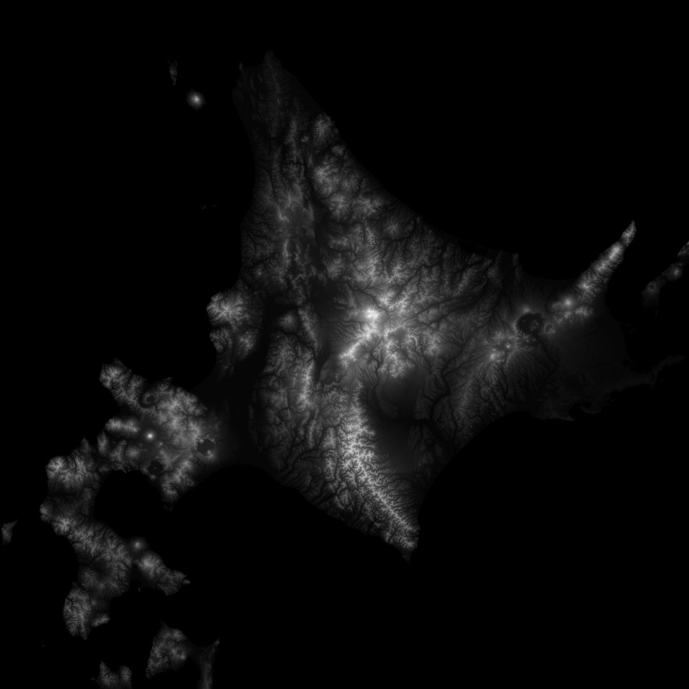

# terrain_downloader
A C++ tool for helping you download larger parts of terrain from terrain.party.
Unfortunately, terrain.party doesn't allow you to download bigger or smaller regions of terrain with varying quality. So downloading big parts of the world or an entire island for example is impossible since the limit is 60km regions and the minimum is 18km regions; with this downloader that limit doesn't exist.  
**Please keep usage of this library to a minimum and cache the files you retrieve. We don't want terrain.party to be taken down! The images generated by terrain.party aren't 100% accurate and do require some manual cleaning if you want to use small areas.**
## Usage
The first thing you have to do is go to terrain.party and find the coordinates of your box. You can do this by clicking the export button when you select a region. This will do a url request like this: http://terrain.party/api/export?box= and after that it has the minimum x coordinate, minimum y coordinate, maximum x coordinate, maximum y coordinate; separated by a comma. At the end it has &name=, which can be ignored. If you select the two minimum and maximum coordinates from the map and get their coordinates, you can have the entire bounds of the region. This can also be done with multiple samples and then getting the smallest and biggest x and y values.
These coordinates can be filled in at the start of the main function (beginX, endX, beginY, endY). Where end > begin. You can also fill in the number of samples it should take (one sample is a 1081x1081 image) for the region. I'd recommend testing w,h = 1,1 with mip 0 to see if your landmass is positioned correctly.  
The "mips" indicate how detailed you want the terrain to become; this of course has limits because the data on terrain.party doesn't have infinite precision. With w,h = 1,1 and startMip,endMip = 0,2 it will generate 5 images (1x 1081x1081 of the entire region and 2x2 1081x1081 of the subregions). The base mips are required if you want to use the regions as a continous terrain, because the first mip has to be used to denormalize the image data (another tool has to detect the highest and lowest point and remap the subareas so there are no seams).
## Big thanks
- terrain.party for giving such an amazing tool for downloading heightmaps and displaying terrain that is so accessible.
- libcurl for a very simple url request system.
- libzip for a very simple zip unpacking system.
## Example: Hokkaidō (北海道)
```cpp
#include "terrain_downloader/terrain_downloader.hpp"

int main(){

	f64 beginX = 139.4062546509583, endX = 145.84600172581386;
	f64 beginY = 41.06404108487939, endY = 45.86941734559742;

	u32 w = 1, h = 1;
	u8 startMip = 0, endMip = 1;

	return terrainDownloader::save(beginX, endX, beginY, endY, w, h, startMip, endMip);
}
```

